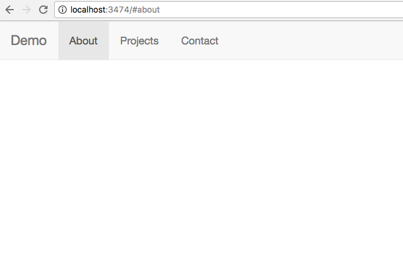

# Gulp Sass Example

Good design of a web page is difficult. This is why many people select a stylesheet framework like [Bootstrap](http://getbootstrap.com/) to have a basic set of styles to work with.

However, design is a language, and you need to translate the higher level concepts of Bootstrap to the lower-level rules of cascaded stylesheets (css). To help doing this, you can use a number of different strategies.

One simple strategy shown in this repository. You use Gulp to "transform" input sass files into output CSS files. To help detecting problems you can add a debug transform and a syntax checker (lint) rule. To import bootstrap sass files, you can use a symbolic link. (Possibly you can extend the search path of the sass transform too as links are not working as easily on Windows)

# Run

To watch styles while editing use:

    $ gulp

To see the result use:

    $ npm install -g superstatic
    $ ss static

# License

MIT, 2016, patrick mulder
